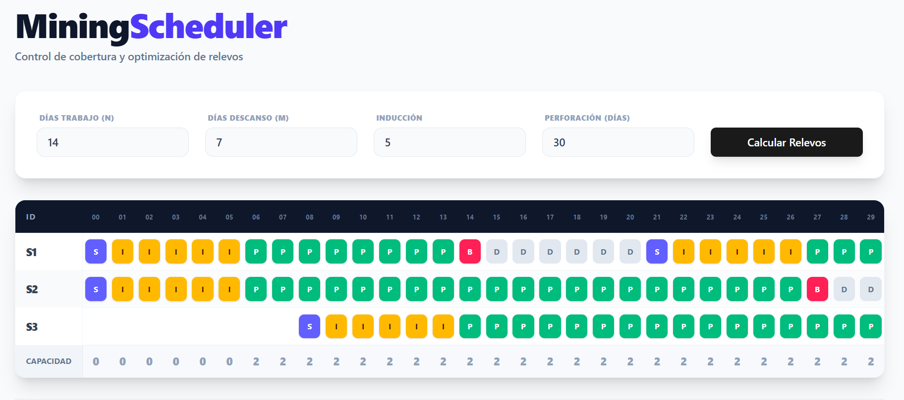
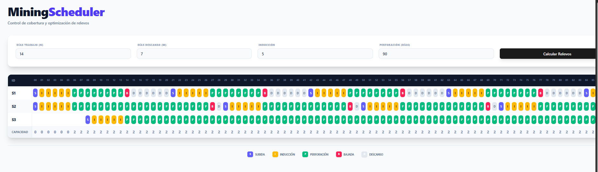
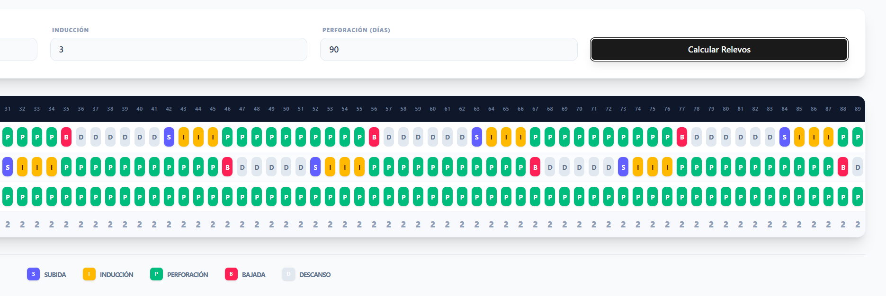

# MiningScheduler - Casos de Prueba

Este repositorio contiene la lógica de programación para minería. A continuación se presenta el primer escenario:

## Caso de Prueba Inicial

**Días de Trabajo**: 14
**Días de Descanso**: 7
**Inducción**: 5
**Perforación**: 30

## Caso de Prueba - 90 Días de Perforación.

**Días de Trabajo**: 14
**Días de Descanso**: 7
**Inducción**: 5
**Perforación**: 90

## Caso de Prueba - 90 Días de Perforación (3 de Inducción)

**Días de Trabajo**: 14
**Días de Descanso**: 7
**Inducción**: 3
**Perforación**: 90

